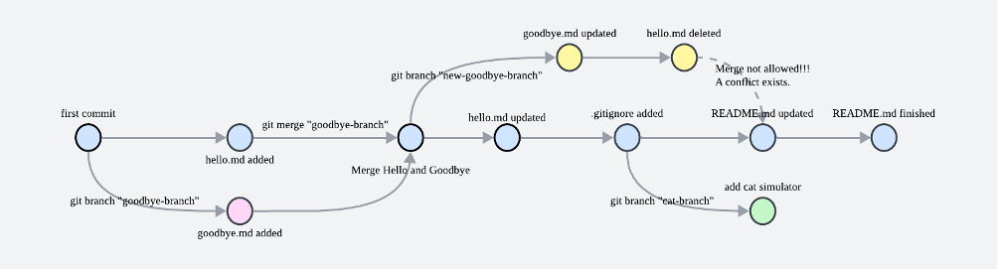

# Git-Example

本仓库为北京大学《计算机网络》课程Lab入门教程，主要用例子展示Git和GitHub的基本使用和其中关于分支创建（branch）与合并（merge）的过程，便于您学习分布式管理自己的项目或进行一些协作开发。

（当然本课程的Lab中完全可以不用到分支，我们也不允许协作开发🤣）

以下是本仓库的版本库，每个节点都对应一次commit（merge也视为commit），从中我们可以很清晰地看到版本分支与合并的过程，以及其生成与依赖关系：



图中不同的颜色代表了归属于不同分支的commit：
- 🩵 main
- 🩷 goodbye-branch
- 💛 new-goodbye-branch
- 💚 cat-branch

版本库中的全部分支均已上传至本仓库。

## Git基本用法

Git由工作区、暂存区和版本库三大部分组成，工作区即我们可见的存放了代码的目录，暂存区用于保存工作区文件的变化（通过`git add`），暂存区中的文件变化则通过`git commit`提交至版本库。

当创建一个新文件/新路径时，其默认状态为不被Git追踪（Untracked），通过执行`git add <filename>`或`git add <directory>`，我们可以将它添加到暂存区当中，状态为“new file"；在修改或删除文件后，使用`git add .`或`git add -A`可以将所有修改和删除信息保存至暂存区，状态为"modified"或"deleted"。`git commit`只会将当前暂存区内保存了的文件变化提交至版本库。

查看工作区与暂存区状态可以使用命令`git status`。

总之，在课程实践中，我们比较推荐在每次提交时都使用以下命令，从而一次追踪此版本所有的文件变化：

```
git add .
git commit -am "Your Commit Message"
```

## Git分支控制

当涉及分工协作的时候，可以与协作者分别编辑不同的分支，再进行合并汇总，这就需要用到Git的分支控制功能。

HEAD是指向当前工作区所在版本（即某一次commit）的符号，一般情况下HEAD都指向某个分支的最新一次commit，指向非最新commit的模式称为"detached mode"。

```
git branch <branch-name>
```

以上命令可以以当前版本为模板创建新分支，在新分支中对文件进行修改不会对老的分支造成任何影响。

```
git checkout <branch-name>
git checkout <commit-hash>
```

以上命令可以将工作区在不同分支中切换：若checkout分支名，则HEAD会指向该分支最新的一次commit；通过checkout某次commit的哈希值（取前7位即可）可以使工作区回到提交至版本库的任意版本。

```
git log --all --graph --decorate
```

以上命令可以显示全部的提交记录，后面的命令选项推荐加上，这样你可以得到漂亮的类树形的版本库信息。

## 本地仓库与远程仓库

参考GitHub在建立空仓库时推荐的命令：

```bash
echo "# Git-Example" >> README.md       # 新建README文档
git init
git add README.md
git commit -m "first commit"
git branch -M main      # 新建main分支
git remote add origin https://github.com/MagicineMaker/Git-Example.git      # 将远程仓库地址设置为origin
git push -u origin main     # 将main推送至origin，-u表示下次执行只需git push
```

当你在本地创建新的分支并希望在远程仓库也创建这个分支时（参考goodbye-branch）：

```bash
(main)$ git branch goodbye-branch
(main)$ git checkout goodbye-branch
(goodbye-branch)$       # do some modifications and commit them
(goodbye-branch)$ git push -u origin goodbye-branch
```

当你在本地合并两个分支并希望远程仓库也如此合并分支时（参考goodbye-branch）：

```bash
(main)$ git merge goodbye-branch
(main)$ git push
```

## Git版本回退

有时候当我们错误地修改或误删了一些文件，但已经不小心commit甚至push到GitHub上了，该如何补救呢？答案是`git reset`命令：

```bash
git reset --soft HEAD^      # --soft回退到上个版本commit前的状态
git reset --hard HEAD^      # --hard回退到上个版本修改前到状态
```

但这样之后，发现远程的GitHub仓库上仍然有最新的版本，此时本地的版本比远程低，直接`git push`是不允许的，需要加一个选项：

```
git push -f
```

这样之后，错误的版本（commit）就在本地和远程都删除了。

## Git-Example的玩法

本仓库已被archived，无法修改，您可以通过

```
git clone https://github.com/MagicineMaker/Git-Example.git
```

将仓库复制到本地，查看仓库的不同分支和版本，或进行一些commit、branch、merge等等的尝试。